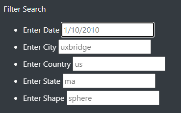
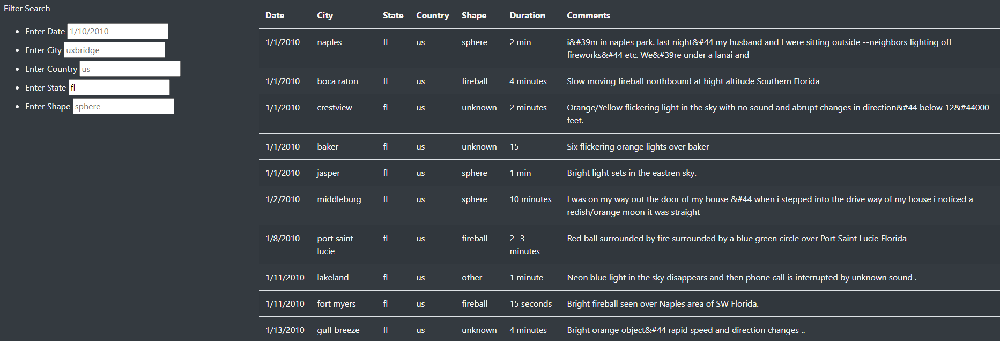

# UFOs

## Overview
Create a webpage and dynamic table that provides an in-depth analysis of UFO sightings by allowing the users to filter for multiple criteria at the same time.

## Results
Users of this webpage can now filter the results by Date, City, Country, State, and Shape. 
- The Date filter can be used by typing any date from 1/10/2010 to 1/13/2010 in the form #/##/####.
- The City filter can be used by typing any city in all lowercase letters.
- The Country filter can be used by typing any country's two-letter abbreviation in lowercase.
- The State filter can be used by typing any state's two-letter abbreviation in lowercase.
- The Shape filter can be used by typing any shape in all lowercase letters.

#### An example of the format of how to type in the search criteria is shown below:

#### An example of the filters being used to search for only UFO sightings in Florida is shown below:

There are placeholders in the Date, City, Country, and Shape filters. The placeholders are not applied to the search results. They are only there to show the format of how to type in the input box. The only filter used is the State filter where "fl" is typed, then the "Enter" button is pressed to trigger the code and search based on input.

## Summary
One drawback of this new design is that the dates only range from 1/10/2010 to 1/13/2010. So while the filter makes it appear as though any date is available, there are only 4 dates available. For further development, more data can be collected and utilized for this webpage. If collecting more data on UFO sightings is not a viable option, it may be more user-friendly to incorporate a drop-down menu for the Date filter instead of an input element. A drop-down menu would eliminate user typing errors and give a more accurate expectation of the dates available to search. A drop-down menu would also be similarly helpful for the other filters on this webpage.
